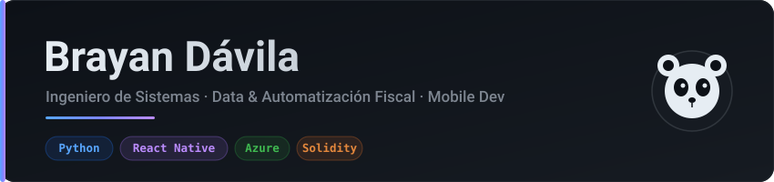

<!-- =========================================================
  Perfil de BrayanBJ27  ·  repo: BrayanBJ27/BrayanBJ27
  ========================================================= -->

<!-- BANNER (SVG propio en ./assets/banner.svg) -->
<div align="center">
  
</div>

<!-- TYPING -->
<div align="center">
  
</div>

<!-- CHIPS SUPERIORES -->
<div align="center">
  <a href="mailto:xavi_braian@hotmail.com">
    
  </a>
  <a href="https://play.google.com/store/apps/dev?id=7619610135574689790">
    
  </a>
  
</div>

<br/>

## 🧑‍💻 Sobre mí

```yaml
rol:        Ingeniero de Sistemas
marca:      PandaDev 🐼
enfoque:    [ Automatización de datos, Pipelines fiscales, Mobile ]
datos:      Python (pandas · openpyxl · xlwings · lxml)
fiscal:     SRI Ecuador · SAP · XML · Excel
ia_rag:     Claude API · Gemini API · Elasticsearch
blockchain: Solidity + Hardhat (supply chain)
ubicacion:  Quito, Ecuador 🇪🇨
```

<br/>

## 🛠️ Tech Stack

<div align="center">

**Lenguajes**


**Frontend / Mobile**


**Backend / Cloud / Data**


</div>

<br/>

## 📊 Métricas de GitHub

<!-- ⚠️ Si estas tarjetas salen en blanco: la instancia pública está caída.
     Reemplaza "github-readme-stats.vercel.app" por TU instancia self-host.
     Instrucciones en el chat. -->
<div align="center">
  
  
</div>

<div align="center">
  
</div>

<br/>

## 🐍 Contribuciones (Snake)

<!-- Aparece SOLO después de correr el workflow snake.yml una vez (ver chat). -->
<div align="center">
  <picture>
    <source media="(prefers-color-scheme: dark)" srcset="https://raw.githubusercontent.com/BrayanBJ27/BrayanBJ27/output/github-contribution-grid-snake-dark.svg"/>
    <source media="(prefers-color-scheme: light)" srcset="https://raw.githubusercontent.com/BrayanBJ27/BrayanBJ27/output/github-contribution-grid-snake.svg"/>
    
  </picture>
</div>

<br/>

## 🚀 Proyectos

<div align="center">

| 🐼 Proyecto | Descripción | Stack |
|:--|:--|:--|
| ⚽ **Copa Soccer 2026** | Simulador de torneo (Google Play) | `React Native` `Firebase` `AdMob` |
| 🃏 **QUIXAR** | Trivia + cartas coleccionables | `React Native` `Expo` |
| 🐼 **Panda Programador** | Animación web desde cero | `HTML` `CSS` `JS` |

</div>
<br/>

<div align="center">
  
  <br/><br/>
  <sub>⭐ Gracias por visitar — <b>Brayan · PandaDev 🐼</b></sub>
</div>
